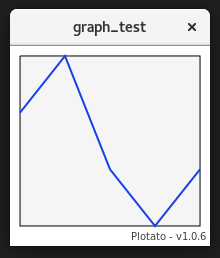
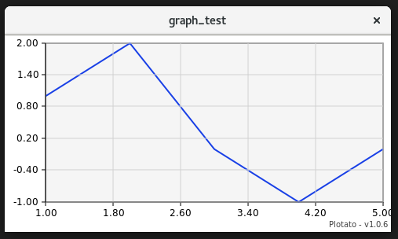
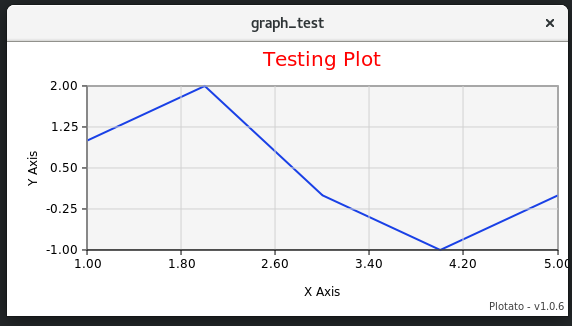

# Plotato


Plotato is a plotting library designed from the ground up to operate in a GTK3 environment, for a diverse set of plotting applications, including live plotting of values. It is written in C++, for ease of use and performance. 

Below, you can see a minimal example of how Plotato can be imported, initialized and used to plot some sample data.

#include <gtk/gtk.h>
#include <Plotato/Plotato.hpp>
#include <vector>

```cpp
int main(int argc, char* argv[])
{
    gtk_init(&argc, &argv);

    GtkWidget* window = gtk_window_new(GTK_WINDOW_TOPLEVEL); // Make a new window.

    GtkWidget* drawing_area = gtk_drawing_area_new(); // Make a drawing area for the graph.
    gtk_container_add(GTK_CONTAINER(window), drawing_area);

    // Declare a new graph in the new drawing area.
    plotato::Graph g(drawing_area);

    // Make some data to plot.
    std::vector<double> x_data {1,2,3,4,5};
    std::vector<double> y_data {1,2,0,-1,0};

    // Plot the data on the graph.
    g.plot(x_data, y_data);


    // Some more gtk stuff for our window.
    g_signal_connect(window, "destroy", G_CALLBACK(gtk_main_quit), nullptr);

    // Show the window, which will automatically draw the plot.
    gtk_widget_show_all(window);
    gtk_main();

    return 0;
}
```

This minimal example produces a window as seen below. 



This window can be resized, withought any additional changes to the code. Plotato automatically handles the resizing events, re-drawing the graph area for the space given. 


Axis can optionally be added by calling the "add_linear_axis" member function on the graph:

```cpp
g.add_linear_axis(plotato::BOTTOM);
g.add_linear_axis(plotato::LEFT);
```



Similarly, titles can be added to each axis, by calling the corresponding function.

```cpp
g.add_x_title("X Axis");
g.add_y_title("Y Axis");
g.add_plot_title("Testing Plot");
```

Setting the style of the plot titles can be done either while calling the add title function by passing a text style object, or later by modifying the style attribute:

```cpp
auto title = g.add_plot_title("Testing Plot");

title->style.font_size = 20;
title->style.text_color = plotato::Color(255, 0, 0);
```




To make a live plot, we simply need to clear the old contents of the graph, add the new contents, and then call the draw() member function of the graph. Below, we will use a callback to continually update the contents of the graph. 


